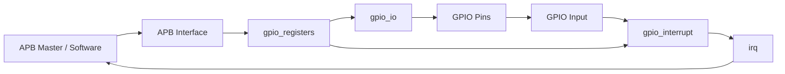

# GPIO Interrupt Controller - SystemVerilog + APB

A parameterized 8-bit GPIO interrupt controller implemented in SystemVerilog and verified using a class-based simulation testbench in AMD Vivado 2025.2 / XSim.

## Project summary

The design combines four RTL blocks:

- `gpio_controller.sv` - top-level integration and APB-facing interface
- `gpio_registers.sv` - memory-mapped GPIO and interrupt control/status registers
- `gpio_interrupt.sv` - edge/level interrupt detection, sticky status, and IRQ generation
- `gpio_io.sv` - GPIO output-enable and output data handling

The verification environment is intentionally class-based and uses:

- `gpio_interface.sv`
- `gpio_transaction.sv`
- `gpio_generator.sv`
- `gpio_driver.sv`
- `gpio_monitor.sv`
- `gpio_scoreboard.sv`
- `tb_gpio_controller.sv`

No physical FPGA board is required for the included functional verification; the DUT is exercised with XSim behavioral simulation.

## Architecture



## Register map

| Offset | Register | Access | Purpose |
|---|---|---|---|
| `0x00` | `DATA_IN` | RO | Current GPIO input state |
| `0x04` | `DATA_OUT` | R/W | Output value to drive |
| `0x08` | `DIR` | R/W | `1 = output`, `0 = input` |
| `0x0C` | `INT_TYPE` | R/W | `0 = level`, `1 = edge` |
| `0x10` | `INT_POLARITY` | R/W | `0 = low/falling`, `1 = high/rising` |
| `0x14` | `INT_ENABLE` | R/W | Per-pin interrupt enable |
| `0x18` | `INT_STATUS` | RO | Latched/pending interrupt status |
| `0x1C` | `INT_CLEAR` | WO | Write `1` to clear a pending bit |

## Interrupt verification sequence

The final testbench performs a real interrupt transaction sequence:

```text
DIR = 0                     -> GPIO0 configured as input
INT_TYPE = 1                -> edge sensitive
INT_POLARITY = 1            -> rising edge
INT_ENABLE = 1              -> enable GPIO0
GPIO0: 0 -> 1               -> generate rising edge
INT_STATUS[0] = 1           -> event latched
IRQ = 1                     -> interrupt propagated
INT_CLEAR[0] = 1            -> clear pending flag
INT_STATUS[0] = 0
IRQ = 0
```

## Verification architecture


### Why the testbench is class-based

The generator creates transactions instead of directly controlling DUT pins. The driver converts those transactions into APB activity or GPIO input stimulus. The monitor observes what happened. The scoreboard compares observations with the expected behavior.

This separation makes it easier to expand the environment with additional interrupt modes and negative tests later.

## Final verification evidence

The completed simulation produced:

```text
PASS: READ DIR = 0x000000ff
PASS: READ DATA_OUT = 0x000000a5
INFO: Interrupt configured
PASS: INT_STATUS = 1
PASS: IRQ = 1
PASS: INT_STATUS CLEARED
PASS: IRQ CLEARED
======================================
 GPIO INTERRUPT TEST COMPLETE
======================================
```

The simulation finished normally at approximately `370 ns`.

See `evidence/final_waveform.png` for the full waveform and `evidence/simulation_pass.txt` for the captured console result.

## What is covered

- APB write transaction
- APB read transaction
- GPIO direction control
- GPIO output data
- Rising-edge interrupt configuration
- GPIO input stimulus
- Sticky interrupt status
- Aggregated IRQ output
- Write-one-to-clear behavior

## Known non-functional warnings

Vivado may report board-part availability warnings when a board is not present or a board database entry is unavailable. Those warnings are unrelated to the behavioral simulation. Timescale warnings can also appear when source files do not explicitly include a `timescale` directive.

## Project history / lessons learned

The debugging process is documented in `docs/DESIGN_AND_VERIFICATION.md` and `docs/LEARNING_AND_DEBUG_NOTES.md`. Important issues that were resolved included an incorrect simulation top, an event-scheduling race in the monitor, duplicated scoreboard syntax, and a testbench that ended before the final transaction completed.

## Toolchain

- SystemVerilog
- AMD Vivado 2025.2
- XSim behavioral simulator
- Linux / Fedora development environment

## Suggested repository layout

```text
GPIO_interrupt_controller/
├── README.md
├── rtl/                         # optional clean organization
│   ├── gpio_controller.sv
│   ├── gpio_registers.sv
│   ├── gpio_interrupt.sv
│   └── gpio_io.sv
├── tb/                          # optional clean organization
│   ├── tb_gpio_controller.sv
│   ├── gpio_interface.sv
│   ├── gpio_transaction.sv
│   ├── gpio_generator.sv
│   ├── gpio_driver.sv
│   ├── gpio_monitor.sv
│   └── gpio_scoreboard.sv
├── docs/
│   ├── DESIGN_AND_VERIFICATION.md
│   └── LEARNING_AND_DEBUG_NOTES.md
└── evidence/
    ├── final_waveform.png
    └── simulation_pass.txt
```

The existing Vivado project can also be committed without reorganizing the source tree immediately; cleanup can be done in a later commit.
