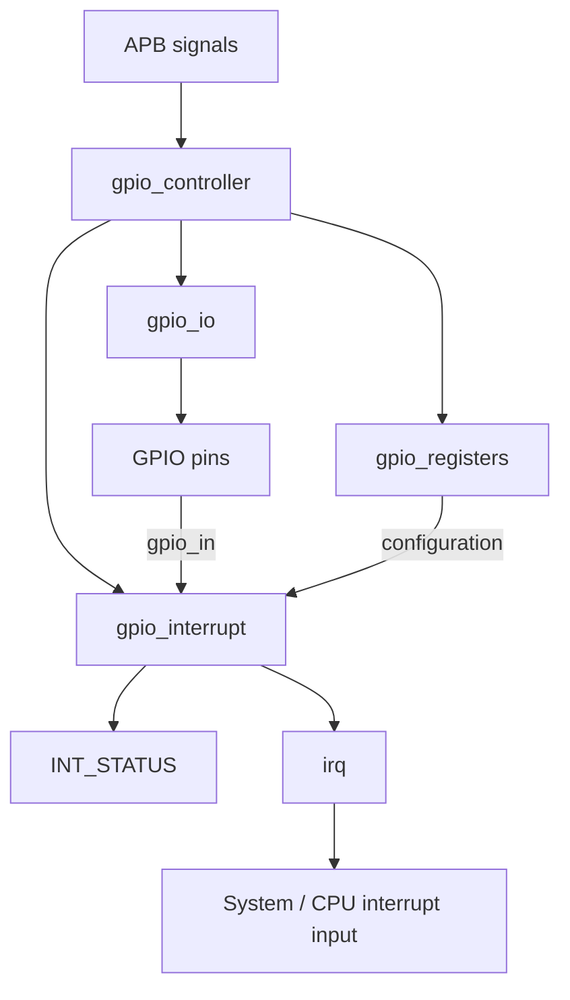

# GPIO Interrupt Controller - Design and Verification Documentation

## 1. Purpose

This project implements an 8-bit GPIO peripheral with an APB control interface and configurable per-pin interrupt generation. The design is written in SystemVerilog and the functional behavior is verified with a class-based simulation environment in Vivado 2025.2 using XSim.

The design target is software simulation. A physical FPGA board is not required for the current verification flow.

## 2. Functional requirements

The controller shall:

1. Accept APB read and write transactions.
2. Provide eight GPIO pins controlled by `DIR` and `DATA_OUT`.
3. Expose the current GPIO input value through `DATA_IN`.
4. Support edge- and level-sensitive interrupt configuration.
5. Support rising/high and falling/low polarity selection.
6. Enable interrupts independently per GPIO pin.
7. Latch interrupt events in `INT_STATUS`.
8. Generate an aggregated `irq` signal from pending enabled interrupts.
9. Clear pending interrupt flags through `INT_CLEAR`.

## 3. Top-level architecture



### Block responsibilities

#### `gpio_controller.sv`

Top-level integration module. It connects the APB interface, register block, interrupt block, and GPIO I/O logic.

#### `gpio_registers.sv`

Stores the software-visible control registers and supplies read data. It maintains output data, direction, interrupt type, interrupt polarity, and interrupt enable information. It also produces the interrupt-clear command used by the interrupt block.

#### `gpio_interrupt.sv`

Detects the configured GPIO interrupt condition. In edge mode it detects a transition; in level mode it evaluates the selected level. Interrupt status is sticky until software clears it. The enabled status bits contribute to the aggregated `irq` output.

#### `gpio_io.sv`

Maps the output data and direction information to `gpio_out` and `gpio_oe`. In this implementation, direction directly controls the output-enable behavior.

## 4. Register map

| Offset | Name | Access | Description |
|---|---|---|---|
| `0x00` | `DATA_IN` | RO | Current GPIO input state |
| `0x04` | `DATA_OUT` | R/W | Software-selected output value |
| `0x08` | `DIR` | R/W | `1 = output`, `0 = input` |
| `0x0C` | `INT_TYPE` | R/W | `0 = level`, `1 = edge` |
| `0x10` | `INT_POLARITY` | R/W | `0 = low/falling`, `1 = high/rising` |
| `0x14` | `INT_ENABLE` | R/W | Per-pin interrupt enable |
| `0x18` | `INT_STATUS` | RO | Latched pending interrupt flags |
| `0x1C` | `INT_CLEAR` | WO | Write `1` to clear the corresponding pending bit |

## 5. APB transaction model

The testbench implements a simple APB setup/access sequence:

```text
Clock edge N:        drive PSEL, PWRITE, PADDR, PWDATA
Clock edge N+1:      assert PENABLE (access phase)
Clock edge N+2:      wait for PREADY
Next falling edge:   return APB controls to idle
```

The design currently returns `PREADY = 1` and `PSLVERR = 0`, so transactions complete without wait states or slave errors.

## 6. Verification environment

The verification environment contains seven class/interface files plus the top-level testbench.

### `gpio_interface.sv`

Groups the APB, GPIO, reset, and interrupt signals into one virtual interface.

### `gpio_transaction.sv`

Represents an APB transaction and also carries GPIO-input stimulus information. The additional `is_gpio_stimulus` field lets the same generator/driver architecture represent an external GPIO event.

### `gpio_generator.sv`

Creates the ordered test sequence and places transactions into the `gen2drv` mailbox.

### `gpio_driver.sv`

Consumes generated transactions and converts them into APB bus activity. For GPIO stimulus transactions it changes `gpio_in` on a clock-safe edge, allowing the DUT to detect the change on the following clock edge.

### `gpio_monitor.sv`

Samples APB transactions after the active clock edge and records observed address, read/write direction, data, GPIO output state, output-enable state, and IRQ status.

A small `#1` sampling delay was intentionally used to avoid a simulation scheduling race where the monitor could sample a DUT register before a nonblocking assignment had updated it.

### `gpio_scoreboard.sv`

Checks observed results against expected values. It verifies the GPIO data path and the interrupt lifecycle:

```text
interrupt not pending
       |
       | GPIO0 rising edge
       v
INT_STATUS[0] = 1, IRQ = 1
       |
       | INT_CLEAR[0] = 1
       v
INT_STATUS[0] = 0, IRQ = 0
```

### `tb_gpio_controller.sv`

Instantiates the DUT and virtual interface, generates the clock, applies reset, creates mailboxes and verification classes, and launches the generator, driver, monitor, and scoreboard concurrently.

## 7. Final test sequence

### Basic GPIO tests

1. Write `DIR = 0xFF`.
2. Read `DIR` and verify `0xFF`.
3. Write `DATA_OUT = 0xA5`.
4. Read `DATA_OUT` and verify `0xA5`.

### Interrupt tests

1. Write `DIR = 0x00` so GPIO0 behaves as an input.
2. Write `INT_TYPE = 0x01` for edge detection on GPIO0.
3. Write `INT_POLARITY = 0x01` for a rising-edge condition.
4. Write `INT_ENABLE = 0x01` to enable GPIO0 interrupt generation.
5. Drive `gpio_in` from `0x00` to `0x01`.
6. Read `INT_STATUS` and verify bit 0 is set.
7. Verify `irq` is asserted.
8. Write `INT_CLEAR = 0x01`.
9. Read `INT_STATUS` and verify bit 0 is cleared.
10. Verify `irq` is deasserted.

## 8. Final simulation result

Captured XSim output:

```text
PASS: READ DIR = 0x000000ff
PASS: READ DATA_OUT = 0x000000a5
INFO: Interrupt configured
PASS: INT_STATUS = 1
PASS: IRQ = 1
PASS: INT_STATUS CLEARED
PASS: IRQ CLEARED
======================================
 GPIO INTERRUPT TEST COMPLETE
======================================
```

The final run completed normally at approximately `370 ns`.

Evidence files:

- `evidence/final_waveform.png`
- `evidence/zoomed_waveform.png`
- `evidence/simulation_pass.txt`

## 9. Waveform interpretation

The most important waveform relationship is:

```text
APB configuration
INT_TYPE = 1
INT_POLARITY = 1
INT_ENABLE = 1
        |
        v
gpio_in: 0 -----> 1
                 rising edge
                     |
                     v
                INT_STATUS = 1
                     |
                     v
                  IRQ = 1
                     |
              INT_CLEAR = 1
                     |
                     v
                INT_STATUS = 0
                     |
                     v
                  IRQ = 0
```

For a human-readable walkthrough of the waveform, see `LEARNING_AND_DEBUG_NOTES.md`.

## 10. Debugging history and corrective actions

### Issue 1 - Wrong simulation top

**Symptom:** The simulation initially used `gpio_controller` directly, producing unconnected or `Z` testbench-facing behavior.

**Cause:** The behavioral simulation top was the RTL module rather than the actual testbench.

**Fix:** Set `tb_gpio_controller` as the simulation top.

**Lesson:** In a class-based verification environment, the top-level simulation module must instantiate the DUT and the verification environment.

### Issue 2 - Monitor sampled a stale write value

**Symptom:** A `DIR = 0xFF` write was reported by the scoreboard as `actual = 0x00` even though the APB transaction was correct.

**Cause:** The monitor sampled on the same simulation timestep as the DUT's sequential nonblocking register update.

**Fix:** Added a small post-clock sampling delay (`#1`) in the monitor.

**Lesson:** HDL simulation has scheduling regions. A monitor must sample after the DUT has updated state, or use clocking blocks in a more advanced environment.

### Issue 3 - Scoreboard syntax corruption

**Symptom:** Vivado reported a syntax error near `else`.

**Cause:** During repeated editing, the scoreboard contained duplicated blocks/braces.

**Fix:** Rebuilt the scoreboard as one clean class with one `run()` task and matching `if/else` and `case/endcase` structure.

**Lesson:** When a structural syntax error appears unexpectedly, recreate the affected small module/class cleanly instead of stacking edits on a corrupted text block.

### Issue 4 - Simulation ended before the last transaction

**Symptom:** The log showed the first three PASS results but no `PASS: READ DATA_OUT`. The simulation stopped at `120 ns`.

**Cause:** The testbench used a fixed `#100` delay after reset release at `20 ns`, so `$finish` occurred at `120 ns`, before the fourth APB transaction completed.

**Fix:** Extended the testbench runtime to `#200` for the initial four-transaction test, and the final interrupt-enabled sequence naturally completed at about `370 ns`.

**Lesson:** A testbench must run long enough to drain all generated transactions. A transaction-count or end-of-test event is more scalable than a fixed delay.

### Issue 5 - Interrupt waveform was initially hard to interpret

**Symptom:** The waveform view was zoomed into roughly 54-60 ns, so the GPIO event was not visible.

**Fix:** Use Zoom Fit and inspect the complete 0-400 ns window, then zoom around the `gpio_in` transition.

**Lesson:** Start with the complete timeline, then zoom into the event of interest.

### Issue 6 - Vivado board warnings

**Symptom:** Many board-part availability warnings appeared at project startup.

**Cause:** Vivado's board database contained references to board parts that were not available/resolved in the installation.

**Impact:** No impact on behavioral XSim verification.

**Lesson:** Separate project-management warnings from actual compile/elaboration/simulation failures.

### Issue 7 - Timescale warnings

**Symptom:** XSim warned that several modules did not have an explicit `timescale` directive.

**Impact:** Simulation still completed successfully with a 1 ps time resolution.

**Optional cleanup:** Add `` `timescale 1ns/1ps `` consistently to the RTL and testbench files.

## 11. Verification limitations

The current environment verifies the main software-visible GPIO and interrupt behavior, but it is not a complete production-grade verification plan. It does not yet exhaustively cover:

- All eight GPIO pins independently
- Falling-edge interrupts
- Level-high and level-low interrupts
- Repeated interrupt events without clearing
- Simultaneous interrupts on multiple pins
- Invalid APB addresses
- APB protocol assertions
- Reset behavior for every register

These are appropriate next extensions rather than prerequisites for the current demonstration.
